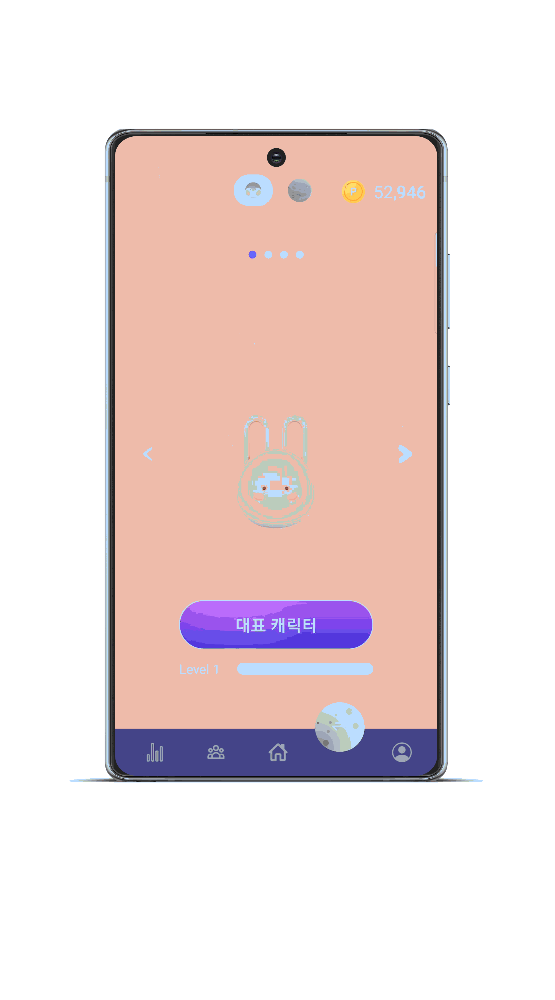

# 소개

## 개요

**_👏 SSAFY 9기 2학기 자율 프로젝트 👏_**  
<aside>
 **갤럭시 워치**를 이용한 러닝 서비스 어플리케이션입니다.

달림은 **나 자신과의 경쟁**에서 시작되었습니다. 러닝을 하며 나 자신과, 그리고 다른 사람과 경쟁을 하면서 성취감도 얻고 러닝에 대한 동기 부여도 얻을 수 있는 서비스입니다.

**워치**를 이용하여 러닝을 하고, 러닝이 끝나면 실시간으로 연동되는 데이터를 **모바일**에서 러닝 기록을 확인할 수 있습니다. 또한 캐릭터, 행성에 대한 **커스터마이징**, 지정된 날짜/시간에 대한 **알림**, 실시간 러닝 **랭킹** 등을 통해 사용자가 꾸준히 러닝을 할 수 있도록 하였습니다.

</aside>

> 2023.10.9 ~ 2023.11.17 (6주)

 
# ⌛ 프로젝트 기간 : 2023. 10. 9 ~ 2023. 11. 17.

# 👥 팀 구성
<table align="center">
  <tr>
    <td align="center"><a href="https://github.com/pum005"> <b>최시환 Back-end </b></a></td>
    <td align="center"><a href="https://github.com/qkrrlgus114"> <b>박기현  Back-end </b></a></td>
    <td align="center"><a href="https://github.com/yeonchaking"> <b>연제경 PM/Full-Stack </b></a></td>
    <td align="center"><a href="https://github.com/Eungae-D"> <b>최규호  Front-end </b></a></td>
    <td align="center"><a href="https://github.com/soyeonnnb"> <b>김소연  Front-end </b></a></td>
    <td align="center"><a href="https://github.com/SeongLI"> <b>이은성  Front-end </b></a></td>
</table>
 

# 📌 주요 기능

### 메인 페이지

### 혼자 달리기 & 함께 달리기

|                                                 혼자 달리기                                                  |                                                                      함께 달리기                                                                      |
| :-----------------------------------------------------------------------------------------------------: | :------------------------------------------------------------------------------------------------------------------------------------------------: |
|                                                                              |                                                                                                                     |
| 갤럭시 워치를 통해 혼자 달리기를 할 수 있습니다. | 함께 달릴 러닝메이트를 설정하고, 해당 러닝메이트와 함께 달릴수 있습니다. 러닝메이트와의 거리 차이가 화면에 실시간으로 표시됩니다. |

### 차트 & 달력

|                                                 차트 & 달력                                                  |                                                             
| :-----------------------------------------------------------------------------------------------------: |
|                                                                              |      
| 혼자 또는 함께 달린 기록을 차트를 통해 간편하게 확인 할 수 있습니다.   속도, 심박수 변화 그래프를 확인 할 수 있습니다.|

### 소셜 - 비교하기

|     비교하기           |                                                                                                                                                                                 
| :---------------------------------------: |
|           |                                                                                                                                                                                                                                                       
| 달림 서비스 사용자들과 나의 정보를 비교할 수 있습니다. | 

 

### 캐릭터 & 테마 설정

|                                                                                         캐릭터 설정                                                                                          |                                                                                                                                                                                 테마 설정                                                                                                                                                                               |
| :-----------------------------------------------------------------------------------------------------------------------------------------------------------------------------------: | :--------------------------------------------------------------------------------------------------------------------------------------------------------------------------------------------------------------------------------------------------------------------------------------------------------------------------------------------------------------------------: |
|                                                                |                                                                                                                                                                                                                                                       |
| 함께 달리기 할 캐릭터를 선택할 수 있습니다.   선택 한 캐릭터가 워치와 모바일에 대표 캐릭터로 적용됩니다. | 함께 달리기할 테마를 선택할 수 있습니다..   선택 한 테마가 워치와 모바일에 대표 테마로 적용됩니다. |

 

### 위젯 & 알림

|                                                                                         위젯                                                                                         |                                                                                                                                                                                 알림                                                                                                                                                                              |
| :-----------------------------------------------------------------------------------------------------------------------------------------------------------------------------------: | :--------------------------------------------------------------------------------------------------------------------------------------------------------------------------------------------------------------------------------------------------------------------------------------------------------------------------------------------------------------------------: |
|                                                                |                                                                                                                                                                                                                                                       |
| 내가 운동한 날짜, 그리고 귀여운 달림 캐릭터 들을 위젯으로 사용할 수 있습니다. | 주기적으로 운동할 날짜를 지정하고, 운동 알림을 받을 수 있습니다.  |

 

# 🔗 주요 기술

- **Brotli 알고리즘을 활용한, 데이터 전송량 70% 압축**
    - 운동 시간이 증가함에 따라, 갤럭시 워치와 서버 간 데이터 전송량이 너무 많이지는 문제가 발생
    - 네트워크 비용을 줄이기 위해, HTTP 생태계의 gzip, brotli 중 압축 성능이 우수한 brotli 알고리즘 적용
      
- **갤럭시 워치에서 제공한 운동 기록 Raw 데이터를 서버에서 필요한 형태로 가공, 저장 파이프라인 구축**
    - 갤럭시워치에서 제공한 운동 raw 데이터를 그대로 MongoDB로 저장하는 것은 불필요한 데이터로 인해 Disk가 낭비되는 문제가 발생   
    - 달림 서비스에서 운동기록을 사용하는 차트와 함께 달리기 기능에 필요한 정보만을 추출해서 저장하도록 변경
    - 불필요한 데이터를 줄이고, 조회 속도를 0.3ms로 개선

## 빌드 환경

| FrontEnd                | BackEnd                                      | Database   | Infra                      |
| :---------------------- | :------------------------------------------- | :--------- | :------------------------- |
| Node.js 18.16.1         | Java 11           | MySQL | AWS EC2 (Ubuntu 20.04 LTS) |
| React.js 18.2.0         | Spring Boot 2.7.15                            | MongoDB    | Docker 23.0.6              |
| react-native        | Gradle 8.1.1                                 | Redis      | Nginx 1.18.0               |
| typescript      | Spring Data JPA                                          |    | Jenkins 2.401.2 LTS        |
| react-native styled components      | Spring Security |            |               |
| | lombok                                       |            |       |
| | Oauth 2.0                                         |   |
| | JWT                                          |  |

 

 

## 산출물

[✨ Figma 디자인 명세](https://www.figma.com/files/team/1293740638879285710/%EC%97%AC%EB%8D%9F%ED%8A%B8?fuid=1055051160728593576)

[🌳 요구사항 명세서](https://www.notion.so/soyeonnnb/d28d940e32a648dcb0a8b6ec1c266109)

[📌 노션 API 명세](https://www.notion.so/soyeonnnb/913aeb51ff6245d3b476cea3091e390a)

[🐳 ERD Cloud](https://www.erdcloud.com/d/T899y4ovym8Q6wPCW)

 
